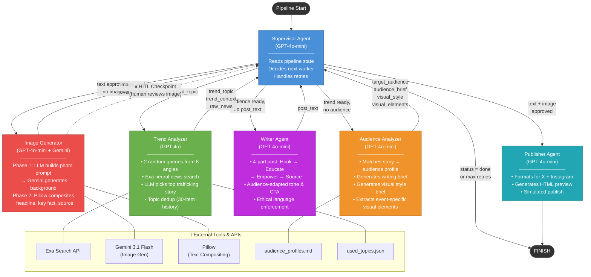

# Update Log

---

1.Images are now generated at 4:5 portrait ratio (1024px), matching Instagram's recommended format natively — no cropping or resizing needed.

## Agent Architecture Overview

Below is the current division of work among the agents in the pipeline. The **Supervisor** sits at the center as an LLM-powered router; all worker agents report back to it after each step.



### Agent Responsibilities Summary

| Agent | Model | Primary Role | Key Capabilities |
|-------|-------|-------------|-----------------|
| **Supervisor** | GPT-4o-mini | Workflow router | Reads state → picks next worker; handles retries (max 2) |
| **Trend Analyzer** | GPT-4o | News discovery | Exa search (2 of 8 angles), topic dedup (30-item history), structured extraction |
| **Audience Analyzer** | GPT-4o-mini | Audience matching | Maps story → audience profile; outputs writing brief + visual style brief + visual elements |
| **Writer** | GPT-4o-mini | Content creation | 4-part post format (Hook/Educate/Empower/Source); ethical language rules; audience-adapted tone |
| **Image Generator** | GPT-4o-mini + Gemini 3.1 Flash | Visual creation | Phase 1: AI photo (no text, 4:5 portrait); Phase 2: Pillow text overlay (NatGeo style) |
| **Publisher** | GPT-4o-mini | Distribution | Formats for X (280 char) + Instagram; generates HTML preview |

> **HITL Checkpoint:** The pipeline pauses after image generation for human review. The reviewer can approve, reject (triggers retry), or provide feedback for regeneration.

---


### Images Now Have Text Overlaid on Top

**Before:** We asked the AI to generate images that include words (headlines, numbers). The AI often misspelled or garbled text in images — a known limitation of image generation models.

**After:** Image generation is now split into two clean steps:

```
1: AI generates a pure photo background (no text)
2: my code adds the headline, key fact, and source
        directly on top — like a magazine cover
```

The text typography (font, size, color) is fully controlled by us, not the AI. The accent color automatically matches the target audience (e.g., blue for business professionals, yellow for general public).

---

### 2. Images Now Reflect the Actual News Story

**Before:** Every image looked similar — usually a generic courtroom or government building — regardless of what the news story was about.

**Why:** The AI was only given vague instructions like *"depict a courtroom"* rather than details from the actual story.

**After:** Before generating the image, the system now automatically extracts 2–3 specific visual details from the news article — exact locations, specific objects found in the case, environmental clues — and makes the image AI use them. For example:

> *"counterfeit ID documents and mobile phones in police evidence bags, Surrey Crown Court interior"*

This makes each image visually tied to the actual story being covered.

---

### 3. The System No Longer Repeats the Same Headline

**Before:** Every run tended to pick the same top news story, resulting in nearly identical content day after day.

**After:** The system now keeps a small record of the last 30 topics it has covered (`used_topics.json`, ~3 KB). Each time it runs, it tells the AI *"don't pick these again"* and chooses a different story.

Additionally, instead of using one fixed search phrase, the system now randomly selects from 8 different search angles (arrests & convictions, new legislation, labor trafficking raids, online exploitation, survivor programs, etc.) to widen the range of news it finds.

---

### 4. Fewer Manual Review Steps (Streamlined Workflow)

**Before:** A human had to approve three steps: the target audience selection, the written post, and the generated image.

**After:** The system now automatically proceeds through audience selection and post writing. A human only reviews and approves the final image before publishing. This reduces manual steps from 3 to 1 per campaign.

---

## Supervisor Agent — Architecture & Principles

The Supervisor is the central orchestrator of the entire content pipeline. Its sole responsibility is **deciding which worker agent should run next.** It sits at the hub of a hub-and-spoke topology — every worker (Trend Analyzer, Audience Analyzer, Writer, Image Generator, Publisher) reports back to the Supervisor after completing its task, and the Supervisor re-evaluates the shared pipeline state before dispatching the next worker. Workers never communicate with each other directly; all coordination flows through the Supervisor. This makes the system easy to extend: adding or removing a worker only requires updating the Supervisor's routing prompt, with no changes to other agents.

**The Supervisor is implemented as a node in LangGraph's `StateGraph`.** After each worker finishes, a fixed edge returns control to the Supervisor node. The Supervisor then uses LangGraph's conditional edges to route the workflow forward: it outputs a `next` field indicating the next worker, and LangGraph follows that field to the corresponding node. When `next` is set to `FINISH`, the graph terminates. This creates a cyclic execution pattern — Supervisor → Worker → Supervisor → Worker → … → FINISH — that keeps looping until the pipeline is complete or an unrecoverable error occurs.

Routing decisions are entirely state-driven. The Supervisor reads the current `AgentState` (a shared TypedDict containing all intermediate outputs like `trend_topic`, `post_text`, `image_path`, and `status`), serializes it into a plain-English summary, and sends it to GPT-4o-mini. The LLM returns a Pydantic-validated `RouteDecision` containing the next worker name and a brief reasoning string. Using `with_structured_output()` guarantees the LLM's response conforms to the expected schema, preventing invalid routing. Compared to the previous hard-coded if-else planner, this LLM-based approach handles edge cases more gracefully, requires only a prompt update to accommodate new agents, and provides built-in explainability through the reasoning field.

The Supervisor also manages fault tolerance through a simple retry mechanism. It maintains a `retry_counts` dictionary tracking how many times each worker has been retried. When a worker fails and the retry count is below two, the Supervisor re-invokes the same worker. Once retries are exhausted, it routes to `FINISH` to prevent infinite loops.
