# Agent-9 Technical Deep Dive

> **Three core systems explained:** How news is discovered via keywords, how campaign images are generated from raw material to final composite, and how Human-in-the-Loop ensures user intent always takes priority.

---

## Table of Contents

- [Part 1: Keyword System & News Search Pipeline](#part-1-keyword-system--news-search-pipeline)
  - [1.1 Pipeline Overview](#11-pipeline-overview)
  - [1.2 The Query Pool (12 Queries × 4 Dimensions)](#12-the-query-pool-12-queries--4-dimensions)
  - [1.3 Query Selection Logic](#13-query-selection-logic)
  - [1.4 Exa Neural Search Execution](#14-exa-neural-search-execution)
  - [1.5 GPT-4o Topic Extraction & Dedup](#15-gpt-4o-topic-extraction--dedup)
  - [1.6 HITL: Human Trend Review](#16-hitl-human-trend-review)
- [Part 2: Image Generation Pipeline](#part-2-image-generation-pipeline)
  - [2.1 End-to-End Overview](#21-end-to-end-overview)
  - [2.2 Stage 1: Audience & Material Analysis](#22-stage-1-audience--material-analysis)
  - [2.3 Stage 2: Prompt Composition](#23-stage-2-prompt-composition--how-visual-style-becomes-a-camera-prompt)
  - [2.4 Stage 2b: Overlay Text Extraction](#24-stage-2b-overlay-text-extraction)
  - [2.5 Stage 3: Gemini Image Generation](#25-stage-3-gemini-image-generation)
  - [2.6 Stage 4: Pillow Text Compositing](#26-stage-4-pillow-text-compositing)
  - [2.7 Design Principles: Visual Philosophy](#27-design-principles-visual-philosophy)
- [Part 3: Human-in-the-Loop (HITL) System](#part-3-human-in-the-loop-hitl-system)
  - [3.1 HITL Checkpoint Map](#31-hitl-checkpoint-map)
  - [3.2 Checkpoint 1: Trend Review](#32-checkpoint-1-trend-review)
  - [3.3 Checkpoint 2: Content Review](#33-checkpoint-2-content-review)
  - [3.4 Checkpoint 3: Post-Publish Refinement](#34-checkpoint-3-post-publish-refinement)
  - [3.5 User Input Priority: How Code Ensures User Intent Wins](#35-user-input-priority-how-code-ensures-user-intent-wins)
  - [3.6 Priority Propagation: One Input, Four Agents](#36-priority-propagation-one-input-four-agents)
- [Technology Stack Reference](#technology-stack-reference)

---

# Part 1: Keyword System & News Search Pipeline

## 1.1 Pipeline Overview


**Data flow:** `12 predefined queries` → `2 selected per run` → `Exa search across 13 domains` → `GPT-4o picks single best story` → `User approves / re-searches`

## 1.2 The Query Pool (12 Queries × 4 Dimensions)

The system maintains **12 natural-language queries** in `src/agents/trend_analyzer.py`, balanced across 4 dimensions:

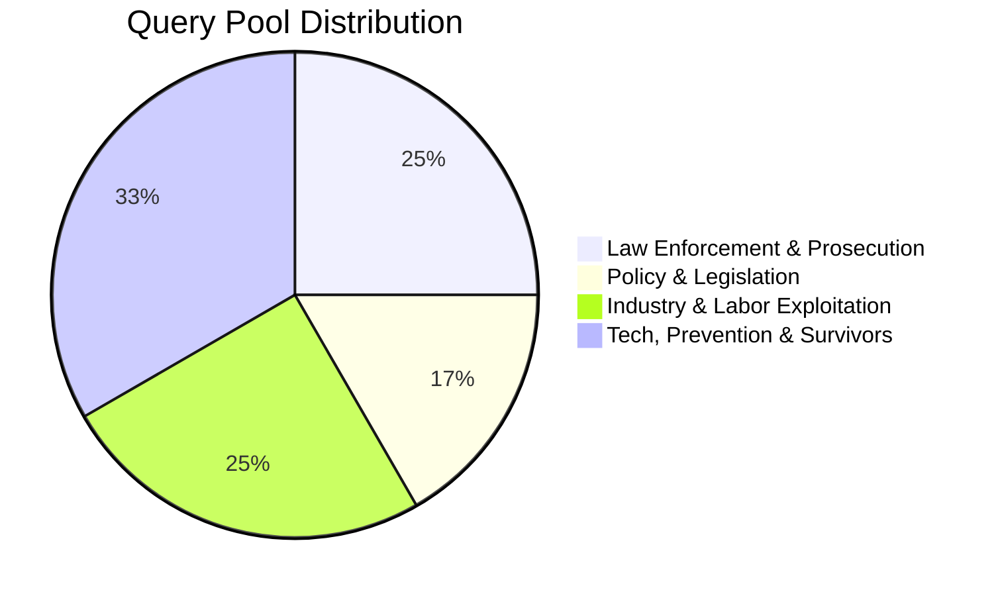

| Dimension | Count | Example Query |
|-----------|:-----:|---------------|
| **Law Enforcement** | 3 | `"human trafficking conviction sentencing court ruling this week"` |
| **Policy & Legislation** | 2 | `"new anti-trafficking law or bill passed in any country"` |
| **Industry & Labor** | 3 | `"forced labor in agriculture construction hospitality or fishing exposed"` |
| **Tech / Prevention / Survivors** | 4 | `"technology or AI tools used to detect or combat human trafficking"` |

> **Why natural language?** The downstream search engine (**Exa**) uses `type="neural"` — a semantic embedding-based search. Full intent sentences outperform keyword fragments.

## 1.3 Query Selection Logic

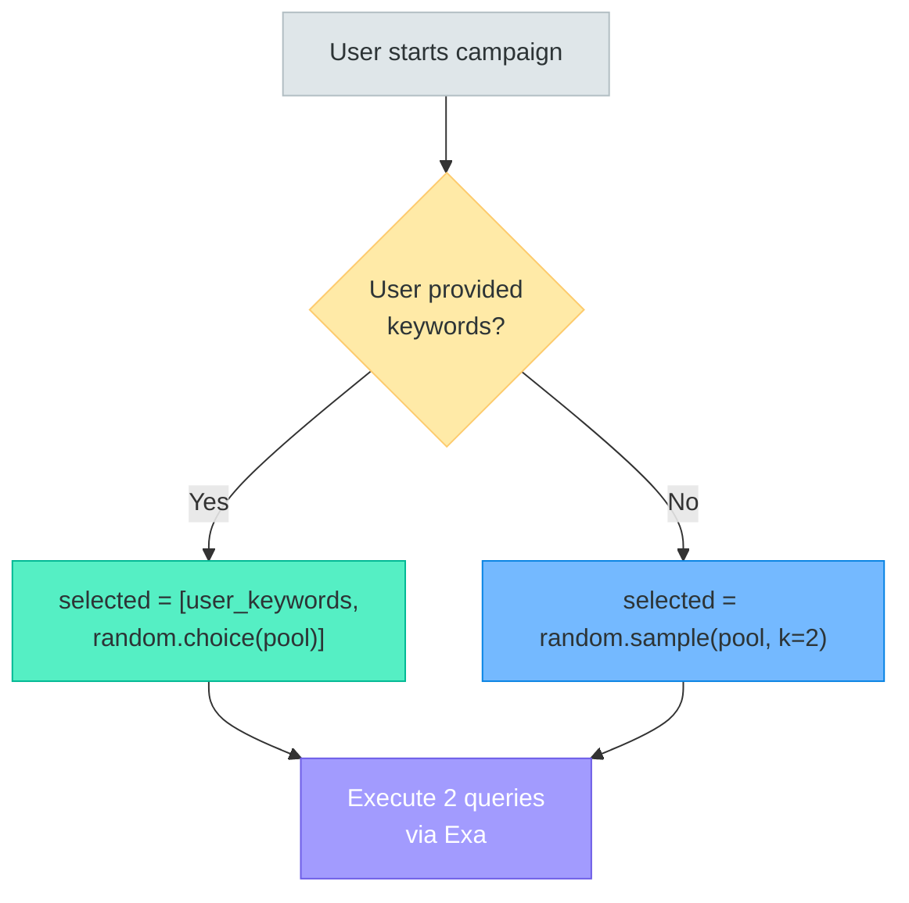

- **With user keywords:** User's input = Query 1; `random.choice()` from pool = Query 2 — guarantees intent + serendipity.
- **Without keywords:** `random.sample(pool, k=2)` — two non-repeating queries for maximum diversity.

## 1.4 Exa Neural Search Execution

Each query is searched across **13 trusted domains** defined in `config.py`:

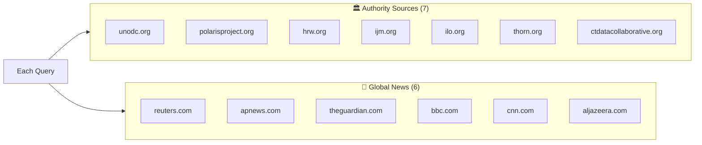

**Per-query execution detail:**

```python
# For each of 2 queries × 13 domains:
Exa.search_and_contents(
    query,
    type        = "neural",        # Semantic search
    category    = "news",          # News-only filter
    start_date  = 7_days_ago,      # Recency window
    include_domains = [domain],    # One domain at a time
    num_results = 3,               # Top 3 per domain
    text        = True             # Include full article text
)
```

**Theoretical max:** `2 × 13 × 3 = 78 articles` (typically 10–30 after dedup and empty-result filtering).

**Reliability layer** (`@reliable_news_tool` decorator):
- `max_retries=3` with exponential backoff (`2^attempt` seconds)
- 30-second timeout per call
- **Crawl4AI** fallback: if Exa returns metadata but `content < 50 chars`, the scraper fetches full article text

## 1.5 GPT-4o Topic Extraction & Dedup

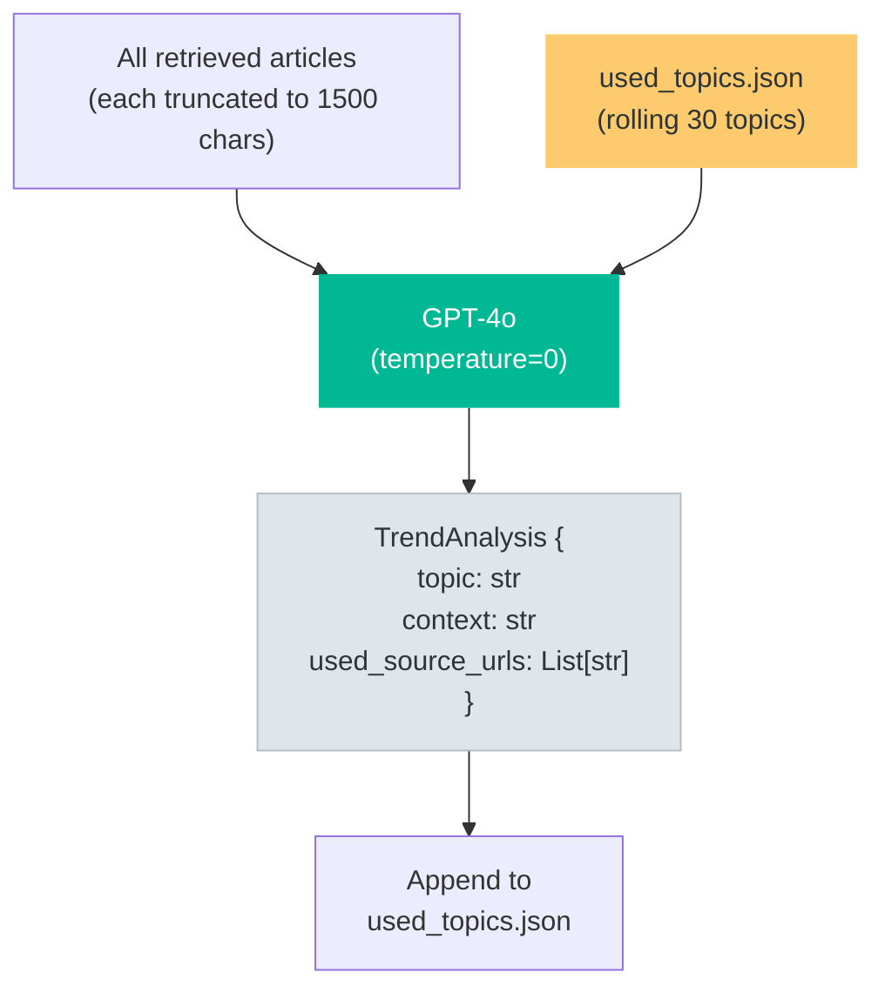

**Rules enforced in prompt:**
- ✅ ONLY human trafficking stories (sex trafficking, labor trafficking, debt bondage)
- ❌ Reject: drug trafficking, general immigration, unrelated human rights
- ✅ Pick highest law-enforcement or legislative impact
- ✅ Dedup: previously used topics injected as "ALREADY COVERED — do NOT pick again"

**Structured output:** Uses `PydanticOutputParser` with `TrendAnalysis` schema — guarantees typed, parseable output.

## 1.6 HITL: Human Trend Review

After topic extraction, the pipeline pauses at `status: "approving_trend"`. The user can:

| Action | Effect |
|--------|--------|
| **Approve** AI recommendation | Continue with extracted topic |
| **Select different article** | Override topic with a specific article from `all_retrieved_news` |
| **Type custom topic** | Override with free-text input (takes priority) |
| **Add creative guidance** | Text propagates to Audience Analyzer, Writer, and Image Generator |
| **Re-search** | Triggers fresh `random.sample()` + Exa search cycle |

---

# Part 2: Image Generation Pipeline

## 2.1 End-to-End Overview

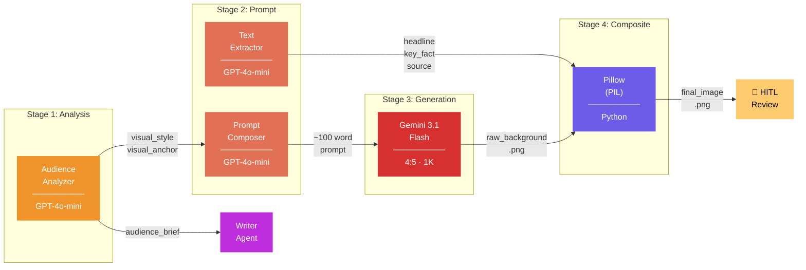

## 2.2 Stage 1: Audience & Material Analysis

**Agent:** `AudienceAnalyzer` · **Model:** `GPT-4o-mini` (`temperature=0`) · **Output:** `Pydantic` structured

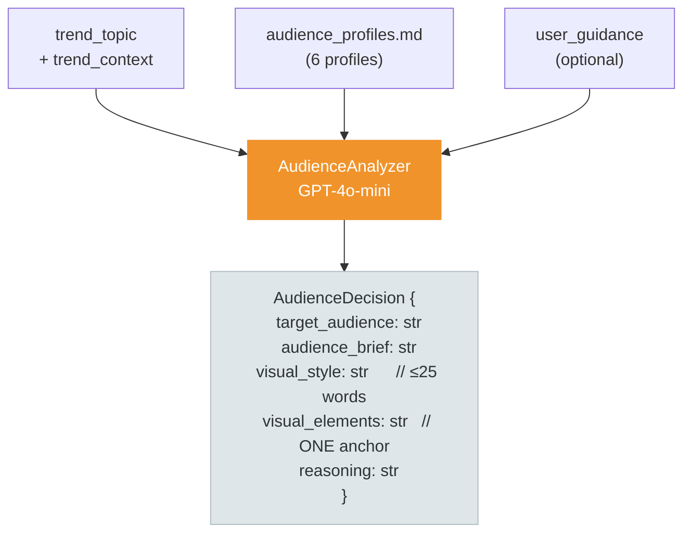

### The 6 Audience Profiles (with Anti-keywords)

Each profile in `config/audience_profiles.md` includes **Trigger Keywords** for matching AND **Anti-keywords** to prevent near-miss collisions:

| Audience | Trigger Signals | Anti-signals |
|----------|----------------|--------------|
| `college_students` | campus, sextortion, dating app, peer recruitment | NOT supply chain, NOT legislative policy |
| `educators` | school, K-12, curriculum, mandatory reporting | NOT parental tools, NOT university-age |
| `business_owners` | supply chain, forced labor, ESG, agriculture, construction, fishing | NOT online/sexual, NOT school-based |
| `parents` | grooming, teen, parental control, online safety | NOT school policy, NOT college-age |
| `lawmakers` | legislation, bill, federal, treaty, prosecution reform | ONLY if clear policy dimension |
| `general_public` | *(default fallback)* | *(catch-all)* |

### Key Outputs That Drive Image Generation

| Output | Size | Example | Used By |
|--------|------|---------|---------|
| `visual_style` | ~20 words | *"Cool blue-steel tones, tungsten lighting, authoritative and restrained"* | Image prompt + accent color picker |
| `visual_elements` | 1 sentence | *"A row of confiscated passports on a cold steel table"* | Image prompt (single visual anchor) |
| `audience_brief` | 2-3 sentences | *"Business-oriented, compliance-focused. Frame as legal liability..."* | Writer Agent |

## 2.3 Stage 2: Prompt Composition — How Visual Style Becomes a Camera Prompt

**Agent:** `ImageGeneratorAgent.llm` · **Model:** `GPT-4o-mini` (`temperature=0.7`) · **Output limit:** ≤120 words

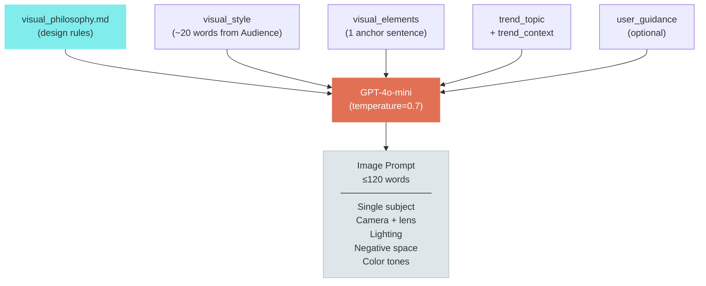

### Rules Enforced in the Prompt Template

| Rule | What it means |
|------|---------------|
| **ONE subject only** | No combined symbols. A passport OR a silhouette — not both. |
| **50-60% negative space** | Frame is mostly blur, shadow, sky, or gradient. |
| **Shallow depth of field** | Sharp subject, soft everything else. |
| **2-3 color tones max** | Restrained palette. Monochrome often wins. |
| **Bottom 25% dark** | Reserved for text overlay — also grounds composition. |
| **Depict the event** | Show WHERE it happened, not WHERE it was discussed. |
| **No text in image** | No headlines, captions, or decorative text rendered by AI. |

### Safety Rules (Hard-coded, Never Removed)

- All human figures → **completely anonymous** (silhouettes, backs of heads, hands, deep shadow)
- No identifiable real individuals, public figures, or named persons
- No children or minors in any form
- No active violence, sexual content, or graphic injury
- No degrading depictions of victims
- When in doubt → symbolic object over human figure

## 2.4 Stage 2b: Overlay Text Extraction

Runs in parallel with prompt composition. A separate `GPT-4o-mini` call (`temperature=0`) extracts poster overlay content:

```
OverlayText {
    headline:    str   // ≤8 words, punchy         → "JUSTICE SERVED IN TEXAS"
    key_fact:    str   // Specific data point       → "3 convicted, $2.4M seized"
    source_line: str   // Short attribution         → "Source: Reuters"
}
```

## 2.5 Stage 3: Gemini Image Generation

**API:** `Google Gemini 3.1 Flash (Image Preview)` · **Aspect:** `4:5` · **Resolution:** `1K`

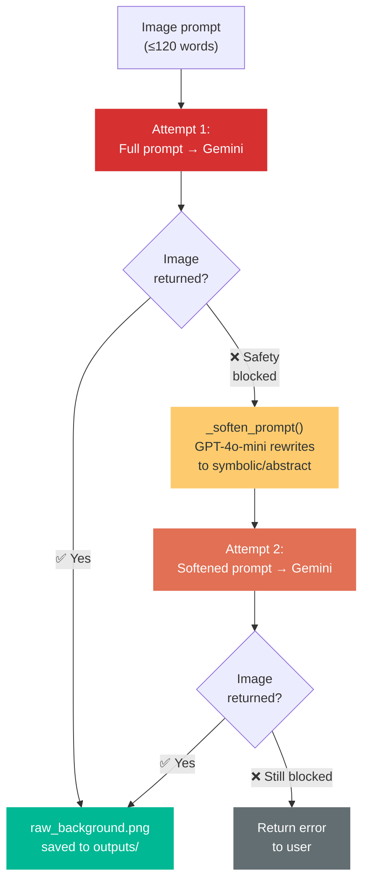

**Safety-filter retry:** If Gemini blocks the original prompt, `_soften_prompt()` uses GPT-4o-mini to rewrite it — replacing confinement scenes with symbolic imagery (e.g., *"a single open door in light"*, *"a broken chain on sunlit concrete"*) while preserving minimalist composition rules.

## 2.6 Stage 4: Pillow Text Compositing

**Library:** `Pillow (PIL)` · **No LLM** — pure Python image processing

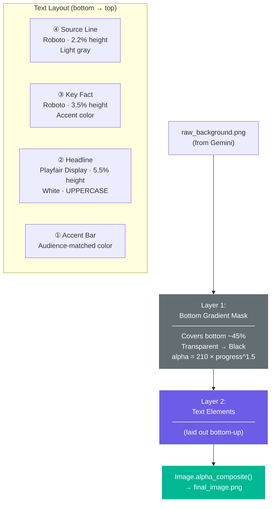

### Accent Color Selection

The accent color (used for **key fact text** and **accent bar**) is determined by keyword matching against `visual_style`:

| `visual_style` contains | Color | RGB | Audience |
|--------------------------|-------|-----|----------|
| `"neon"` or `"vibrant"` | 🟢 Neon green | `(0, 255, 170)` | college_students |
| `"blue-steel"` | 🔵 Corporate blue | `(100, 180, 255)` | business_owners |
| `"warm"` + `"amber"` | 🟡 Warm amber | `(255, 200, 80)` | parents |
| `"desaturated"` | ⚪ Muted silver | `(200, 200, 200)` | lawmakers |
| `"cream"` | 🟤 Warm gold | `(230, 180, 100)` | educators |
| *(default)* | 🟡 NG Yellow | `(255, 200, 0)` | general_public |

### Font Stack & Fallback

| Element | Primary Font | Fallback |
|---------|-------------|----------|
| Headline | `PlayfairDisplay[wght].ttf` (serif) | → `arial.ttf` → PIL default |
| Key Fact | `Roboto[wdth,wght].ttf` (sans-serif) | → `arial.ttf` → PIL default |
| Source | `Roboto[wdth,wght].ttf` (sans-serif) | → `arial.ttf` → PIL default |

Fonts bundled in `config/fonts/`. `_load_font()` provides graceful fallback.

### Text Layout Algorithm (Bottom-Up)

```
  Position                  Element                  Sizing
  ───────────────────────── ──────────────────────── ──────────────
  y = height - 3.5%         Source line              font: 2.2% h
                     ↑ 1.5% spacing
  y = above source          Key fact (accent color)  font: 3.5% h
                     ↑ 1.5% spacing
  y = above fact             HEADLINE (white)         font: 5.5% h
                     ↑ 1.5% gap
  y = above headline         Accent bar              height: 0.5% h
```

Each text element uses:
- `_wrap_text()` — pixel-accurate word wrapping within `width - 12%` margins
- `_draw_text_with_shadow()` — 2px offset black drop shadow for readability against any background

## 2.7 Design Principles: Visual Philosophy

All image generation follows `config/visual_philosophy.md`:

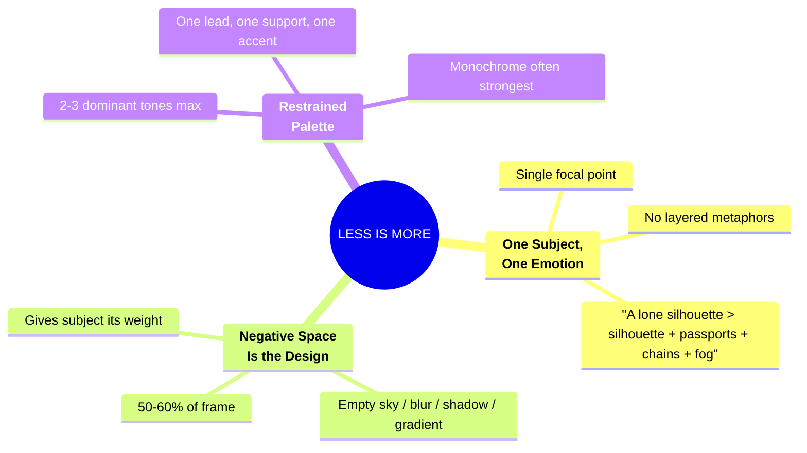

### Composition Rules

| Rule | Implementation |
|------|---------------|
| **Simplicity over storytelling** | Image is one frozen moment, not a narrative illustration |
| **Shallow depth of field** | Sharp subject, soft bokeh environment — naturally reduces clutter |
| **Geometric clarity** | Clean lines, symmetry, or rule-of-thirds placement |
| **Bottom 25% reserve** | Dark zone for text overlay; doubles as visual grounding |

### What NOT To Do

| ❌ Don't | ✅ Instead |
|----------|-----------|
| Multiple symbolic objects (chains + passports + candles) | Pick the **single** strongest symbol |
| Crowded environmental detail | A **hint** of setting is enough |
| Heavy-handed metaphors | **Subtlety** is more powerful |
| Stock-photo collages | One subject with **breathing room** |

### Reference Aesthetic

> **Apple** product photography · **NYT Magazine** covers · **Amnesty International** posters · **Magnum Photos** editorial
>
> Clean, confident, one clear point of focus, quiet gravity.

---

# Part 3: Human-in-the-Loop (HITL) System

## 3.1 HITL Checkpoint Map

The pipeline has **3 intervention points** where user intent can override AI decisions. These are not simple approve/reject gates — each checkpoint offers multiple actions that reshape the downstream pipeline.

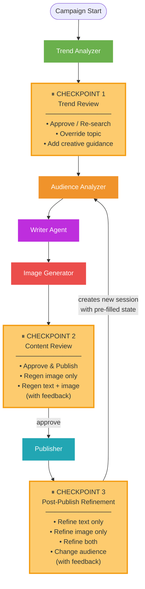

### Implementation: LangGraph `interrupt_after`

HITL checkpoints are powered by **LangGraph's interrupt mechanism** in `src/workflow/graph.py`:

```python
app = workflow.compile(
    checkpointer=memory,
    interrupt_after=["trend_analyzer", "image_generator"]
)
```

When `trend_analyzer` or `image_generator` finishes, LangGraph **suspends execution** and saves the full state to the `MemorySaver` checkpointer. The FastAPI endpoint returns the paused state to the frontend. When the user submits their decision, `graph.update_state()` injects the user's choices, and `graph.stream(None, config)` **resumes** from exactly where it stopped.

Checkpoint 3 (post-publish refinement) works differently — it creates an entirely **new session** with pre-filled state via the `/refine` endpoint, selectively clearing only the fields that need regeneration.

---

## 3.2 Checkpoint 1: Trend Review

**Trigger:** `status: "approving_trend"` · **Endpoint:** `POST /api/campaign/{id}/approve-trend` · **File:** `api.py:152`

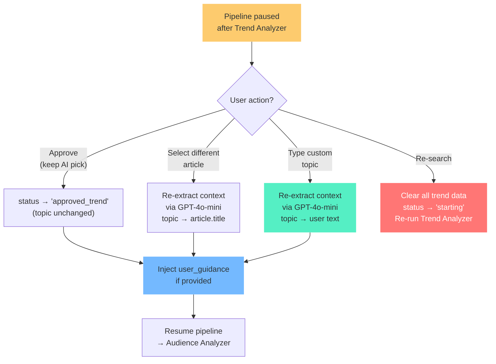

### User inputs at this checkpoint

| Input | State field | Priority | Downstream effect |
|-------|------------|----------|-------------------|
| **Custom topic** | `trend_topic` | **Overrides** AI-selected topic entirely | New context re-extracted via LLM; propagates to all downstream agents |
| **Article selection** | `trend_topic` | **Overrides** AI pick with chosen article | Context re-extracted from that specific article |
| **Creative guidance** | `user_guidance` | **Additive** — injected into 3 downstream agents | Audience Analyzer, Writer, and Image Generator all receive it |
| **Re-search** | Clears `trend_*` fields | **Destructive** — restarts search from scratch | Fresh `random.sample()` + Exa search cycle |

### Code: Custom topic overrides AI (api.py:181-213)

```python
if req.custom_topic and req.custom_topic.strip():
    # ★ User's custom topic REPLACES the AI-selected topic entirely
    update["trend_topic"] = req.custom_topic.strip()
    update["trend_context"] = _re_extract_context(...)   # LLM re-generates context

elif req.selected_article_title and req.selected_article_title.strip():
    # ★ User's article choice REPLACES the AI-selected topic
    update["trend_topic"] = chosen.get("title", ...)
    update["trend_context"] = _re_extract_context(...)

# else: keep AI recommendation as-is (no override)
```

**Priority rule:** `custom_topic` > `selected_article` > AI recommendation. The code checks in this exact order with early return.

---

## 3.3 Checkpoint 2: Content Review

**Trigger:** `status: "approving_image"` · **Endpoint:** `POST /api/campaign/{id}/approve-image` · **File:** `api.py:246`

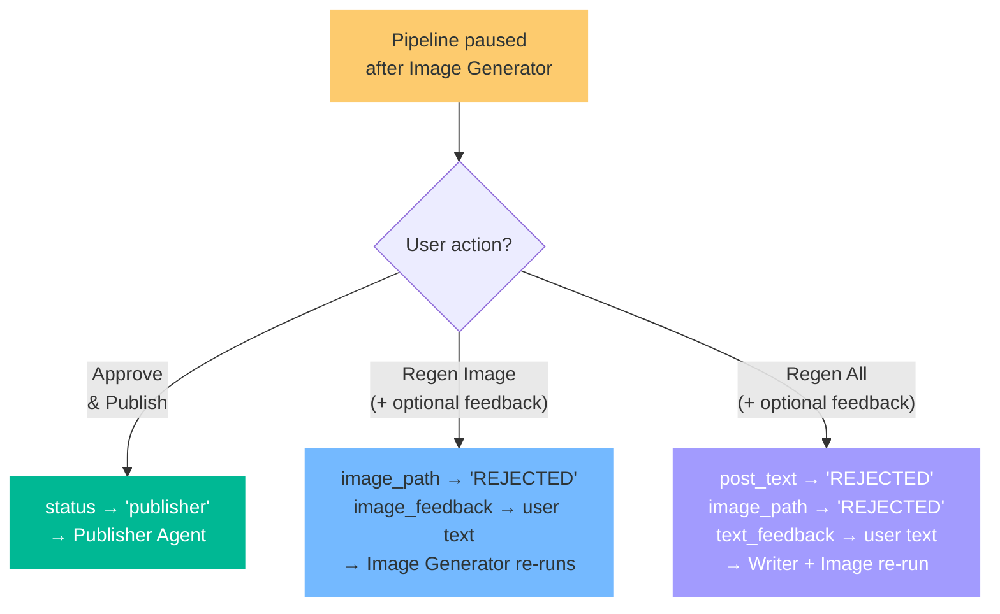

### User inputs at this checkpoint

| Input | State field | Priority | Effect |
|-------|------------|----------|--------|
| **Image feedback** | `image_feedback` | **Appended** to prompt as `CRITICAL INSTRUCTION` | Directly concatenated to the end of the image prompt |
| **Text+Image feedback** | `text_feedback` + `image_feedback` | **Injected** as `REFINEMENT MODE` in Writer | Writer receives previous post + user's change request |

### Code: User feedback becomes CRITICAL INSTRUCTION (image_generator.py:147-149)

```python
feedback = state.get("image_feedback")
if feedback:
    image_prompt += f"\nCRITICAL INSTRUCTION FROM USER FOR REGENERATION: {feedback}"
```

The label `CRITICAL INSTRUCTION` is deliberate — it signals to Gemini that this directive takes precedence over the original prompt's creative direction.

### Code: Writer receives refinement as override (writer.py:47-55)

```python
text_feedback = state.get("text_feedback")
if text_feedback:
    refinement_instruction = (
        f"\n\nREFINEMENT MODE — The user reviewed the previous post and wants changes."
        f"\n\nPREVIOUS POST:\n{previous_text}"
        f"\n\nUSER FEEDBACK: {text_feedback}"
        f"\n\nRevise the post based on this feedback. Keep what works, fix what the user pointed out."
    )
```

---

## 3.4 Checkpoint 3: Post-Publish Refinement

**Trigger:** `status: "done"` · **Endpoint:** `POST /api/campaign/{id}/refine` · **File:** `api.py:288`

This checkpoint creates a **new LangGraph session** with pre-filled state, selectively clearing only the fields that need regeneration:

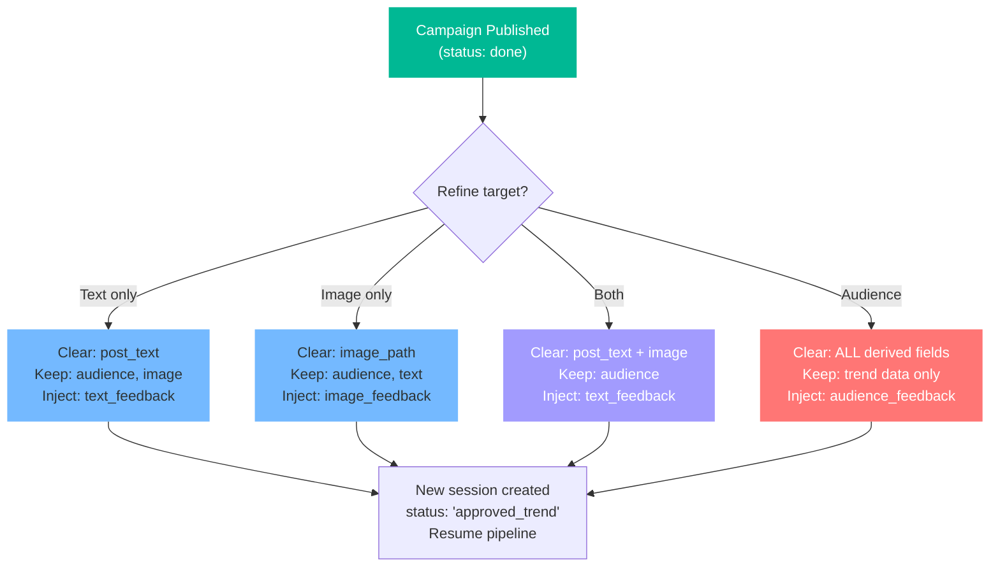

### State cloning strategy (api.py:309-361)

| Target | Fields cleared | Fields kept | Feedback injected as |
|--------|---------------|-------------|---------------------|
| `text_only` | `post_text` | audience, image, visual_* | `text_feedback` → Writer |
| `image_only` | `image_path` | audience, text, visual_* | `image_feedback` → Image Generator |
| `both` | `post_text` + `image_path` | audience, visual_* | `text_feedback` → Writer |
| `audience` | ALL derived (audience, text, image, visual_*) | trend data only | `audience_feedback` → Audience Analyzer |

The Supervisor's deterministic fast-paths ensure the pipeline picks up from the right agent based on which fields are present vs. `None`.

---

## 3.5 User Input Priority: How Code Ensures User Intent Wins

The system uses **5 distinct mechanisms** to guarantee that user input always takes precedence over AI-generated content:

### Mechanism 1: Direct State Override

User input **replaces** AI-generated values at the `AgentState` level before the pipeline resumes.

```python
# api.py — custom topic overrides AI selection
update["trend_topic"] = req.custom_topic.strip()   # AI value erased
```

This is the strongest form of priority — the AI's output is simply overwritten. Used for: **custom topic**, **article selection**.

### Mechanism 2: Prompt-Level CRITICAL Labeling

User feedback is injected into LLM prompts with explicit priority labels that instruct the model to treat it as top-priority.

```python
# image_generator.py — "CRITICAL INSTRUCTION" label
image_prompt += f"\nCRITICAL INSTRUCTION FROM USER FOR REGENERATION: {feedback}"

# writer.py — "REFINEMENT MODE" section
refinement_instruction = f"\n\nREFINEMENT MODE — The user reviewed..."
    + f"\n\nUSER FEEDBACK: {text_feedback}"
    + f"\n\nRevise the post based on this feedback."

# audience_analyzer.py — "REFINEMENT" directive
f"REFINEMENT: The previous audience was '{previous_audience}'. "
f"The user wants to change the targeting. Their feedback:\n{audience_feedback}"
```

Each agent uses a different label, but the pattern is consistent: user feedback is positioned **after** the base instructions, with an explicit directive to prioritize it.

### Mechanism 3: Conditional Prompt Replacement

When a user provides a `writer_prompt`, it **replaces** the entire generated prompt body — not appended, but substituted.

```python
# writer.py:78-80
writer_prompt = state.get("writer_prompt")
if writer_prompt:
    human_content = writer_prompt + retry_instruction + refinement_instruction
    # ★ The original human_content (topic + context + audience brief) is discarded
```

### Mechanism 4: Multi-Agent Propagation

A single user input at Checkpoint 1 (`user_guidance`) propagates to **3 downstream agents**, each receiving it in their prompt:

```python
# audience_analyzer.py:110-115
if user_guidance:
    messages.append(HumanMessage(content=
        f"USER CREATIVE DIRECTION: ... Factor this into your audience selection, "
        f"visual style, and visual elements decisions:\n{user_guidance}"))

# writer.py:70-72
if user_guidance:
    human_content += f"\n\nUSER CREATIVE DIRECTION: {user_guidance}"

# image_generator.py:133-135
if user_guidance:
    user_guidance_block = f"USER CREATIVE DIRECTION (incorporate this into the scene):\n{user_guidance}"
```

### Mechanism 5: Selective State Clearing (Refinement)

The refinement endpoint uses **surgical state clearing** — only the fields that need regeneration are set to `None`, while everything else is preserved. This forces the Supervisor to route to exactly the right agent.

```python
# api.py — "text_only" refinement
prefilled.update({
    "target_audience": current_state.get("target_audience"),  # ★ KEPT
    "post_text": None,                                         # ★ CLEARED → forces Writer re-run
    "image_path": current_state.get("image_path"),            # ★ KEPT
    "text_feedback": req.feedback,                             # ★ INJECTED
})
```

---

## 3.6 Priority Propagation: One Input, Four Agents

This diagram shows how a single piece of user input (`user_guidance` from Checkpoint 1) flows through the entire pipeline:

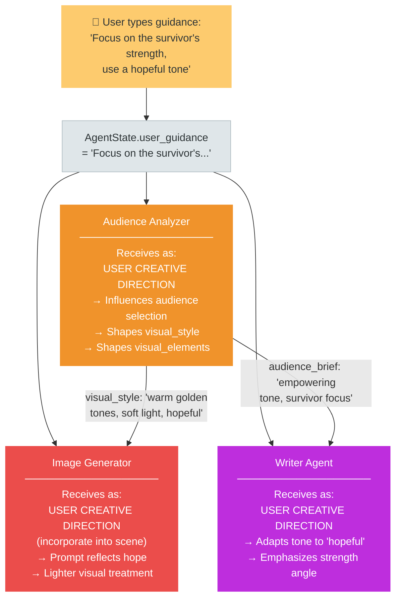

**Double influence on Image Generator:** Note that `user_guidance` reaches the Image Generator through **two paths**:
1. **Directly** — injected into the image prompt template as `USER CREATIVE DIRECTION`
2. **Indirectly** — it influenced the Audience Analyzer's `visual_style` and `visual_elements`, which are also fed into the image prompt

This dual-path design ensures the user's creative intent is deeply embedded in the final image, not just a superficial addition.

### Summary: User Priority Mechanisms by Checkpoint

| Checkpoint | User Input | Priority Mechanism | Code Location |
|------------|-----------|-------------------|---------------|
| **CP1** | Custom topic | **Direct Override** — replaces `trend_topic` | `api.py:182` |
| **CP1** | Article selection | **Direct Override** — replaces `trend_topic` | `api.py:196` |
| **CP1** | Creative guidance | **Multi-Agent Propagation** — 3 agents receive it | `api.py:218` |
| **CP1** | Re-search | **State Clear** — all trend data wiped, pipeline restarts | `api.py:163` |
| **CP2** | Image feedback | **CRITICAL Label** — appended to prompt with highest priority | `image_generator.py:148` |
| **CP2** | Text+Image feedback | **REFINEMENT MODE** — Writer receives previous post + feedback | `writer.py:49` |
| **CP3** | Text refinement | **Selective Clear** — only `post_text` cleared, feedback injected | `api.py:316` |
| **CP3** | Image refinement | **Selective Clear** — only `image_path` cleared, feedback injected | `api.py:328` |
| **CP3** | Audience change | **Full Clear** — all derived fields wiped, feedback to Audience Analyzer | `api.py:350` |

---

# Technology Stack Reference

| Component | Technology | Purpose |
|-----------|-----------|---------|
| **Search** | Exa (`type="neural"`) | Semantic news discovery across 13 domains |
| **Scraping Fallback** | Crawl4AI | Full article text when Exa returns metadata only |
| **Topic Analysis** | GPT-4o (`temp=0`) | Deterministic topic extraction + dedup |
| **Audience Matching** | GPT-4o-mini (`temp=0`) | Structured audience decision via Pydantic |
| **Prompt Composition** | GPT-4o-mini (`temp=0.7`) | Creative photography prompt ≤120 words |
| **Text Extraction** | GPT-4o-mini (`temp=0`) | Headline / key_fact / source for overlay |
| **Image Generation** | Gemini 3.1 Flash | Raw photograph, 4:5 aspect, 1K resolution |
| **Image Compositing** | Pillow (PIL) | Gradient mask, text overlay, accent bar |
| **Workflow Engine** | LangGraph (StateGraph) | Supervisor-worker routing + HITL interrupts |
| **Observability** | LangSmith | Tracing via `@traceable` decorators |
| **Frontend** | React 19 + Vite | Sidebar + main content layout, REST polling |
| **API** | FastAPI | REST endpoints, in-memory session store |
